# PeerLink Authentication System — Deep Dive

> This document explains every aspect of the authentication system in PeerLink.  
> It is written for developers of all skill levels — from beginners to experienced engineers.

---

## Table of Contents

1. [Architecture Overview](#1-architecture-overview)
2. [Tech Stack & Why](#2-tech-stack--why)
3. [Database Schema (Firestore)](#3-database-schema-firestore)
4. [Email/Password Registration](#4-emailpassword-registration)
5. [Email/Password Login](#5-emailpassword-login)
6. [Google OAuth Flow](#6-google-oauth-flow)
7. [Token Refresh Flow](#7-token-refresh-flow)
8. [Logout Flow](#8-logout-flow)
9. [Password Reset Flow](#9-password-reset-flow)
10. [JWT Deep Dive](#10-jwt-deep-dive)
11. [Security Measures](#11-security-measures)
12. [Session Management](#12-session-management)
13. [Rate Limiting](#13-rate-limiting)
14. [File Map](#14-file-map)

---

## 1. Architecture Overview

At the highest level, the authentication system is split into three layers:

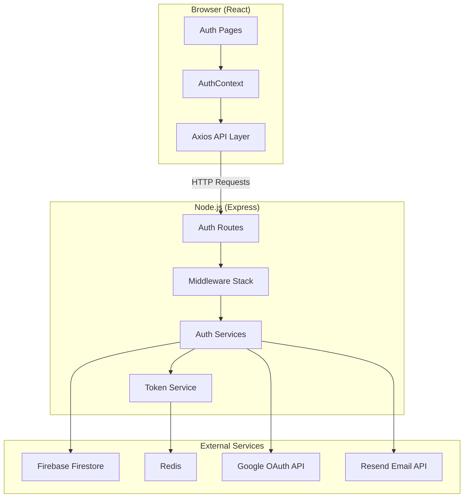

**How the layers interact:**

| Layer | Responsibility | Example |
|-------|----------------|---------|
| **Client** | Renders forms, stores access token in memory, attaches it to requests | Login page, AuthContext, Axios interceptor |
| **Server** | Validates input, runs business logic, issues tokens, persists data | Auth routes, services, middleware |
| **External** | Stores data, caches tokens, verifies Google identity, sends emails | Firestore, Redis, Google APIs, Resend |

---

## 2. Tech Stack & Why

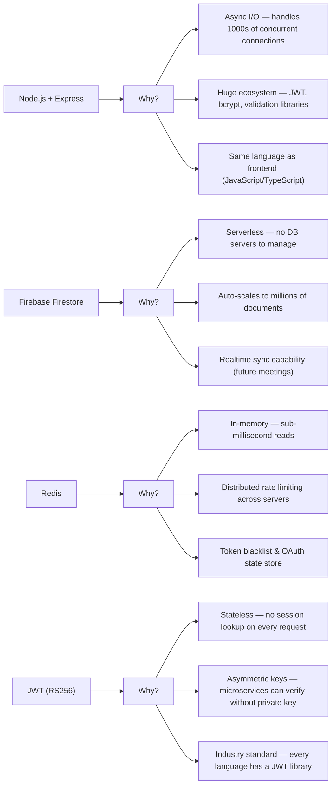

### Key Decisions

| Decision | Why |
|----------|-----|
| **Fully custom auth** (not Firebase Auth) | Full control, no vendor lock-in, works with any database |
| **httpOnly cookies for refresh tokens** | Immune to XSS attacks — JavaScript cannot read them |
| **RS256 (asymmetric) JWT** | Private key signs, public key verifies. Microservices can verify tokens without access to the private key |
| **Refresh token rotation** | Every refresh issues a new refresh token + revokes the old one. This limits the damage if a token is stolen |
| **Redis for rate limiting** | When you have multiple server instances, rate limit state must be shared — not possible with in-memory storage |

---

## 3. Database Schema (Firestore)

Firestore is a NoSQL document database. Data is organized into **collections** containing **documents**.

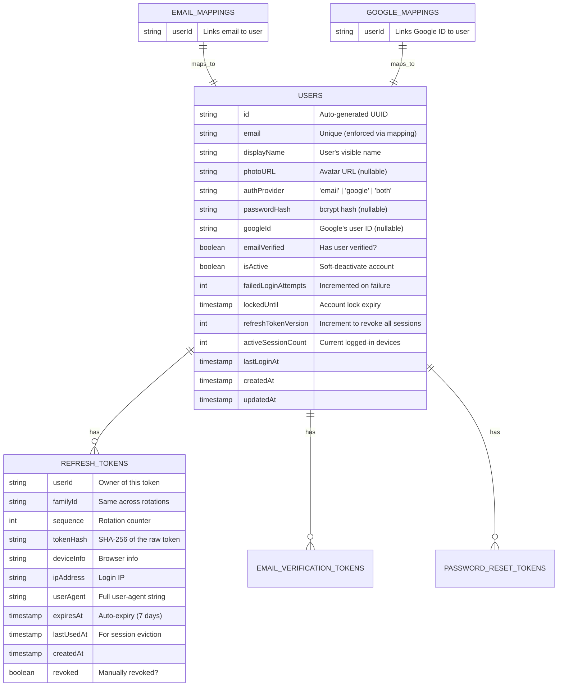

### Why separate email/google mapping collections?

Firestore **does not have a built-in `UNIQUE` constraint** like SQL databases. If two users somehow registered with the same email, we'd have data corruption.

To enforce uniqueness, we use **separate mapping documents** that act as uniqueness locks:

```
/emailMappings/{base64("user@example.com")} → { userId: "abc123" }
```

When registering, we do this inside a **Firestore transaction**:

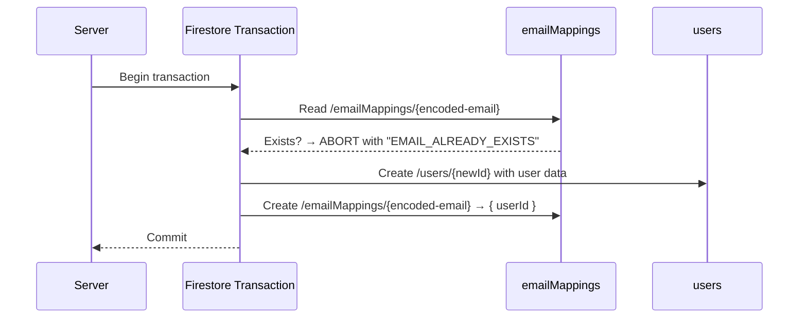

This pattern guarantees that no two users can have the same email, even under concurrent signup requests.

---

## 4. Email/Password Registration

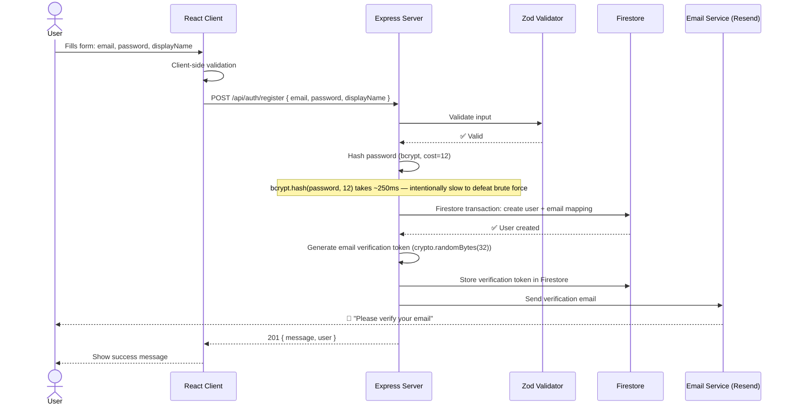

### Password Hashing — Why bcrypt?

When you store passwords, you **never** store the actual password. You store a **hash** — a one-way mathematical transformation.

```
Password "MySecret123!"
        │
        ▼
  bcrypt.hash(password, 12)
        │
        ▼
  $2b$12$LJ3m...8xHu (60-character hash)
```

- **bcrypt is intentionally slow** — cost factor 12 means ~250ms per hash
- **It includes a random salt** — same password produces different hashes each time
- **Slow hashing defeats brute force** — trying 1000 passwords takes 4+ minutes

### Password Requirements (enforced by Zod)

```javascript
// Regex validation on the server
/^(?=.*[a-z])(?=.*[A-Z])(?=.*\d)(?=.*[!@#$%^&*()_+\-=\[\]{};':"\\|,.<>\/?]).{8,}$/
```

| Rule | Why |
|------|-----|
| Minimum 8 characters | Prevents short, guessable passwords |
| At least 1 uppercase | Increases entropy |
| At least 1 lowercase | Increases entropy |
| At least 1 digit | Increases entropy |
| At least 1 special character | Greatly increases entropy |
| Maximum 128 characters | Prevents hash-length denial-of-service attacks |

---

## 5. Email/Password Login

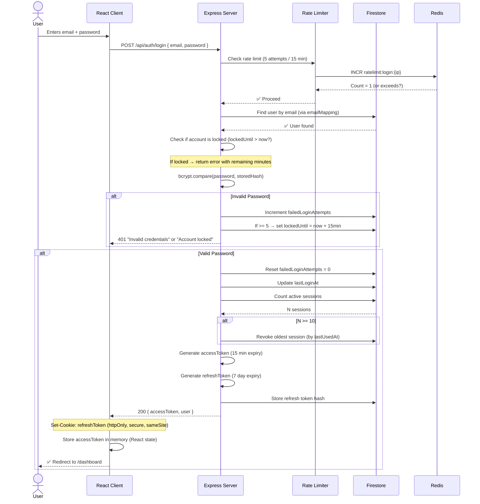

### What happens on the client after login?

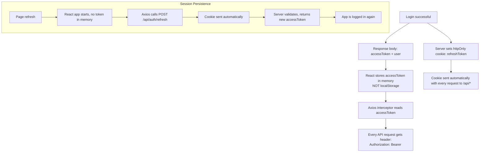

**Critical**: Access tokens are stored in React state (memory), not localStorage. This means:
- ✅ An XSS attack cannot steal the access token
- ✅ The refresh token is in an httpOnly cookie (inaccessible to JavaScript)
- ❌ Page refresh loses the access token — but the interceptor automatically refreshes it via the cookie

---

## 6. Google OAuth Flow

This is the most complex flow. It uses the **Authorization Code Grant** (the gold standard of OAuth flows).

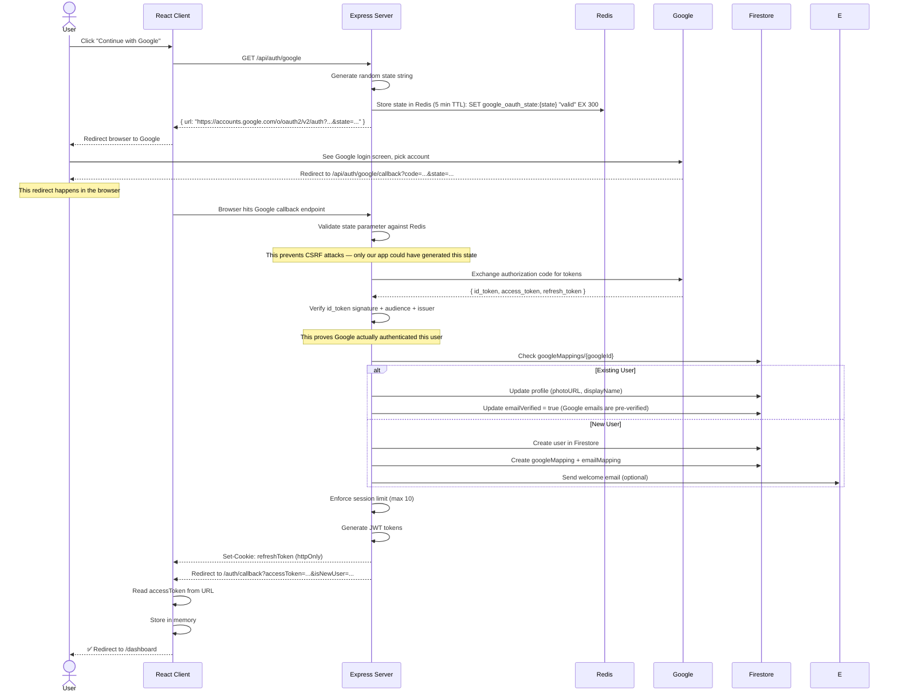

### Why the "state" parameter matters

Without the state parameter, an attacker could:

1. Create their own PeerLink login URL
2. Trick you into clicking it
3. You authenticate with Google
4. The attacker's server intercepts the code
5. They log into YOUR account

The state parameter prevents this because:

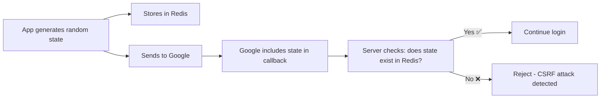

---

## 7. Token Refresh Flow

Access tokens expire after 15 minutes. When they do, the client's Axios interceptor automatically refreshes them.

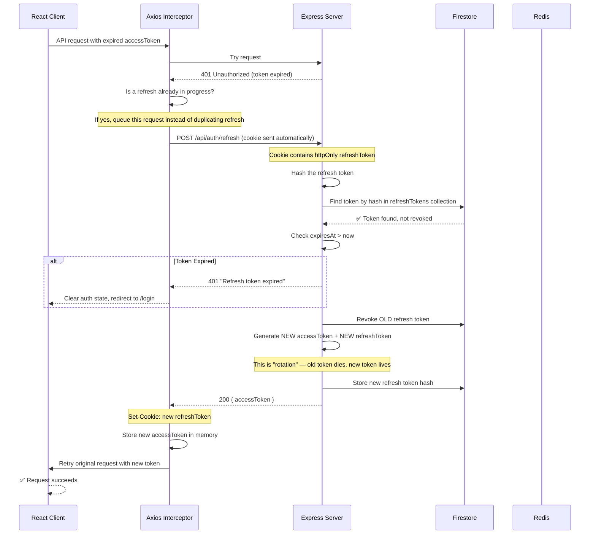

### Why rotate refresh tokens?

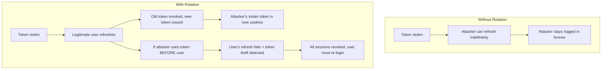

### Token Reuse Detection

This is an advanced security feature:

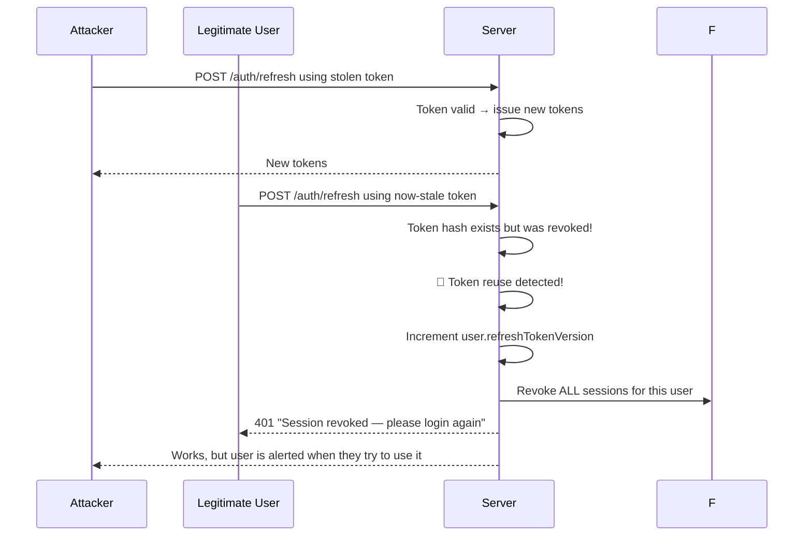

---

## 8. Logout Flow

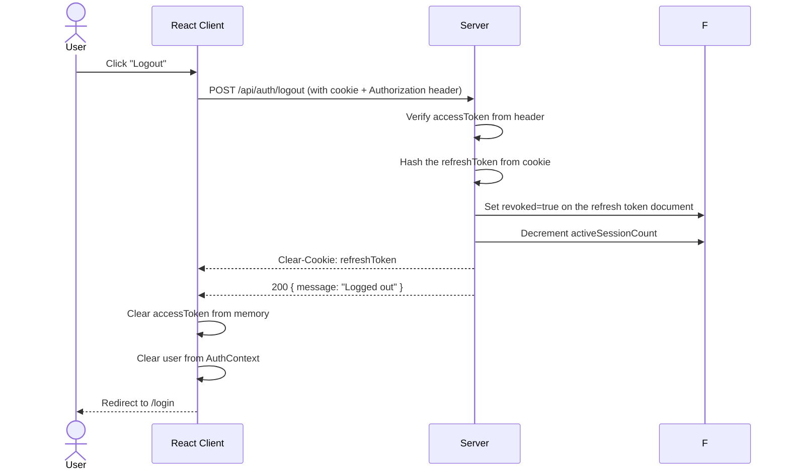

---

## 9. Password Reset Flow

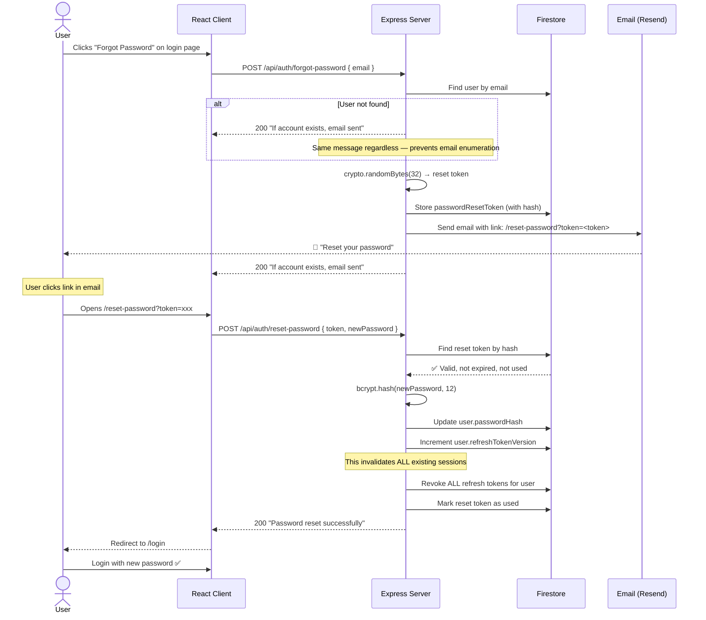

---

## 10. JWT Deep Dive

### What is a JWT?

A JSON Web Token is a self-contained token that looks like this:

```
eyJhbGciOiJSUzI1NiIsInR5cCI6IkpXVCJ9.          ← Header (base64)
eyJ1c2VySWQiOiI4YjNjIiwidG9rZW5WZXJzaW9uIjoxfQ.  ← Payload (base64)
[n8E3...signature]                                  ← Signature
```

### Anatomy of a PeerLink Access Token

```json
{
  "alg": "RS256",
  "typ": "JWT"
}
```

```json
{
  "userId": "8ebfdfc9-849d-43a2-ae91-cf3edc7d696a",
  "email": "user@example.com",
  "displayName": "John Doe",
  "tokenVersion": 3,
  "iat": 1712345678,
  "exp": 1712346578,
  "iss": "peerlink"
}
```

### RS256 Signing (Asymmetric)

```mermaid
graph LR
    subgraph Server["Backend Server"]
        PK[Private Key<br>Keep SECRET]
        S[JWT.sign(payload, privateKey)]
    end
    
    subgraph Client["Browser"]
        T[JWT Token]
    end
    
    subgraph AnyService["Any Microservice / API Gateway"]
        PubK[Public Key<br>Safe to share]
        V[JWT.verify(token, publicKey)]
    end
    
    PK --> S
    S --> T
    T --> V
    PubK --> V
    V --> R{Valid?}
    R -->|Yes| Allow[✅ Allow request]
    R -->|No| Deny[❌ Reject request]
```

**Why asymmetric (RS256) over symmetric (HS256)?**

| | HS256 (symmetric) | RS256 (asymmetric) |
|---|---|---|
| One secret signs AND verifies | ✅ Simple | ❌ Shared secret is a risk |
| Separate keys for sign/verify | ❌ Not possible | ✅ Private signs, public verifies |
| Microservice verification | ❌ Must trust the secret to every service | ✅ Public key is safe to distribute |
| Key rotation | ❌ All services need new secret simultaneously | ✅ Just rotate the key pair |
| **Our choice** | | ✅ **RS256** |

---

## 11. Security Measures

### Defense in Depth

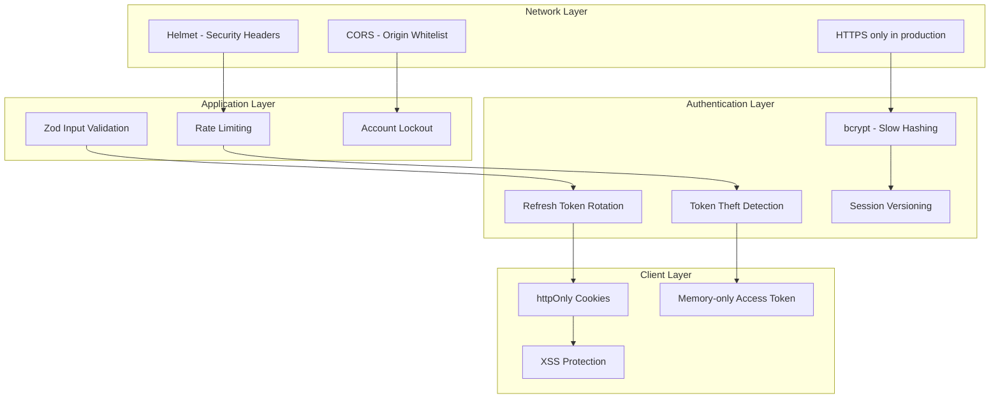

### Each measure explained

| # | Measure | What it does | How it works |
|---|---------|-------------|--------------|
| 1 | **bcrypt cost=12** | Makes password cracking expensive | ~250ms per hash — 1000 attempts = 4 minutes |
| 2 | **Account lockout** | Prevents brute force on specific accounts | 5 failed attempts → 15 minute lock |
| 3 | **Rate limiting** | Prevents brute force across accounts | 5 login attempts per 15 min per IP |
| 4 | **httpOnly cookies** | Protects refresh token from XSS | JavaScript cannot read httpOnly cookies |
| 5 | **Memory-only access token** | Protects access token from XSS | React state (not localStorage) = gone on tab close |
| 6 | **Refresh token rotation** | Limits stolen token window | Old token revoked on every refresh |
| 7 | **Token versioning** | Force logout all devices instantly | Increment `refreshTokenVersion` → all old JWTs rejected |
| 8 | **CSRF via state param** | Protects Google OAuth | Random state stored in Redis, verified on callback |
| 9 | **Zod validation** | Prevents injection attacks | Schema enforcement on every endpoint |
| 10 | **Helmet** | Security HTTP headers | Sets CSP, X-Frame-Options, etc. |
| 11 | **Password strength rules** | Ensures strong passwords | Regex: uppercase + lowercase + number + special + 8+ chars |
| 12 | **Same response for unknown email** | Prevents email enumeration | Forgot password returns same message whether email exists or not |

---

## 12. Session Management

### Session Limit (Max 10 Devices)

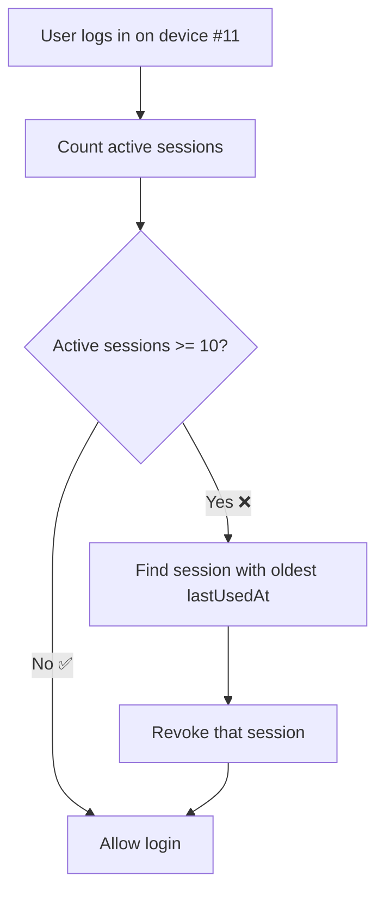

### Session Versioning

Every user has a `refreshTokenVersion` field. This is included in the JWT payload:

```
JWT Payload: { userId, email, tokenVersion: 3 }
User Document: { refreshTokenVersion: 3 }
```

When the server verifies a JWT, it checks:

```
jwt.tokenVersion === user.refreshTokenVersion ? ✅ Allow : ❌ Reject
```

This means we can **instantly invalidate all sessions** by incrementing `refreshTokenVersion`. This happens when:

- User changes password
- Password reset is completed
- Token theft is detected
- Admin deactivates account

---

## 13. Rate Limiting

Rate limiting prevents abuse by limiting how many requests a client can make in a given time window.

### Configuration

| Endpoint | Window | Max requests | Why this limit |
|----------|--------|-------------|----------------|
| `/register` | 1 hour | 3 | Prevents mass account creation |
| `/login` | 15 min | 5 | Prevents brute force password guessing |
| `/forgot-password` | 1 hour | 3 | Prevents spamming someone's inbox |
| `/refresh` | 15 min | 10 | Prevents excessive token rotation |
| `/change-password` | 1 hour | 3 | Limits password change attempts |
| `/verify-email` | 1 hour | 5 | Prevents abuse of verification endpoint |
| Global | 1 min | 60 | General DDoS protection |

### How it works (with Redis)

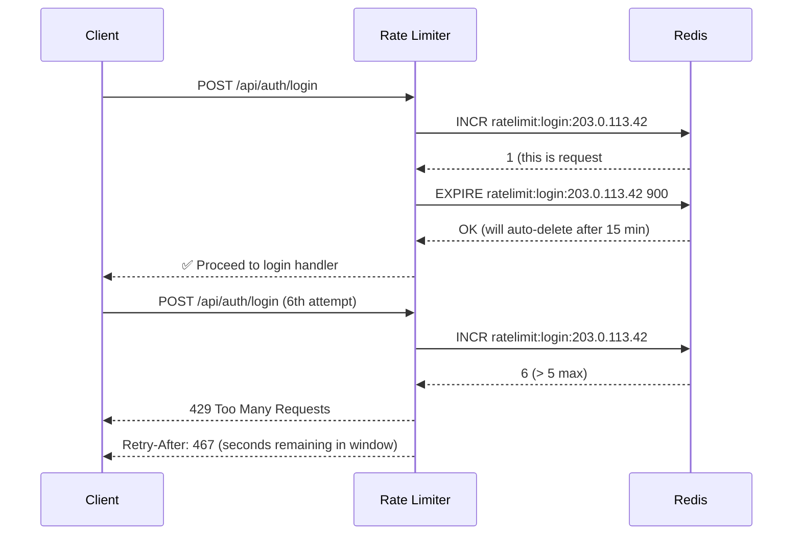

In development (single server), rate limiting uses an **in-memory store**. In production (multiple servers), it uses Redis so that all servers share the same rate limit state.

---

## 14. File Map

```
server/src/
├── config/
│   ├── env.ts              # Environment variable validation (Zod)
│   ├── firebase.ts         # Firebase Admin SDK initialization
│   └── redis.ts            # Redis client (rate limiting, state store)
│
├── models/
│   ├── userModel.ts        # Firestore CRUD for users + email/google mappings
│   └── tokenModel.ts       # Firestore CRUD for refresh + verification tokens
│
├── services/
│   ├── authService.ts      # Core business logic (register, login, logout, etc.)
│   ├── tokenService.ts     # JWT issue, verify, rotate, blacklist
│   ├── googleService.ts    # Google OAuth URL generation + token verification
│   └── emailService.ts     # Resend integration for verification + reset emails
│
├── middleware/
│   ├── authenticate.ts     # JWT verification + user status check (Redis cached)
│   ├── rateLimiter.ts      # Per-endpoint rate limiting
│   └── validate.ts         # Generic Zod schema runner
│
├── routes/
│   └── authRoutes.ts       # 12 auth endpoints
│
├── validators/
│   └── authValidators.ts   # Zod schemas for every request body/query
│
├── types/
│   └── index.ts            # Shared TypeScript interfaces
│
├── utils/
│   ├── errors.ts           # Custom error classes (AppError, AuthError, etc.)
│   └── helpers.ts          # Utility functions (hash, encode, sanitize)
│
└── app.ts                  # Express entry point

client/src/
├── context/
│   └── AuthContext.tsx      # React context: user state, login, logout, refresh
├── hooks/
│   └── useAuth.ts          # Shortcut hook to access AuthContext
├── services/
│   ├── api.ts              # Axios instance with auto-refresh interceptor
│   └── authApi.ts          # Typed API functions for every auth endpoint
├── pages/
│   ├── Login.tsx           # Login form + Google button
│   ├── Register.tsx        # Registration form + Google button
│   └── AuthCallback.tsx    # Google OAuth redirect handler
├── components/
│   └── ProtectedRoute.tsx  # Redirects to /login if not authenticated
├── utils/
│   └── validators.ts       # Client-side input validation
└── index.css               # Auth page styles
```

---

## Summary

The PeerLink authentication system implements industry-standard security practices:

- **Passwords** are hashed with bcrypt (cost 12)
- **Tokens** use RS256 JWT with short-lived access tokens (15 min) and rotated refresh tokens (7 days)
- **Sessions** are capped at 10 devices with automatic eviction of least-recently-used sessions
- **Rate limiting** protects every endpoint against abuse
- **httpOnly cookies** protect refresh tokens from XSS
- **Memory-only storage** protects access tokens from XSS
- **Asymmetric signing** allows any microservice to verify tokens without the private key
- **Atomic Firestore transactions** guarantee email uniqueness at any scale
- **Redis** provides shared state for rate limiting, token blacklisting, and OAuth CSRF protection

This design scales to hundreds of thousands of users without architectural changes.
